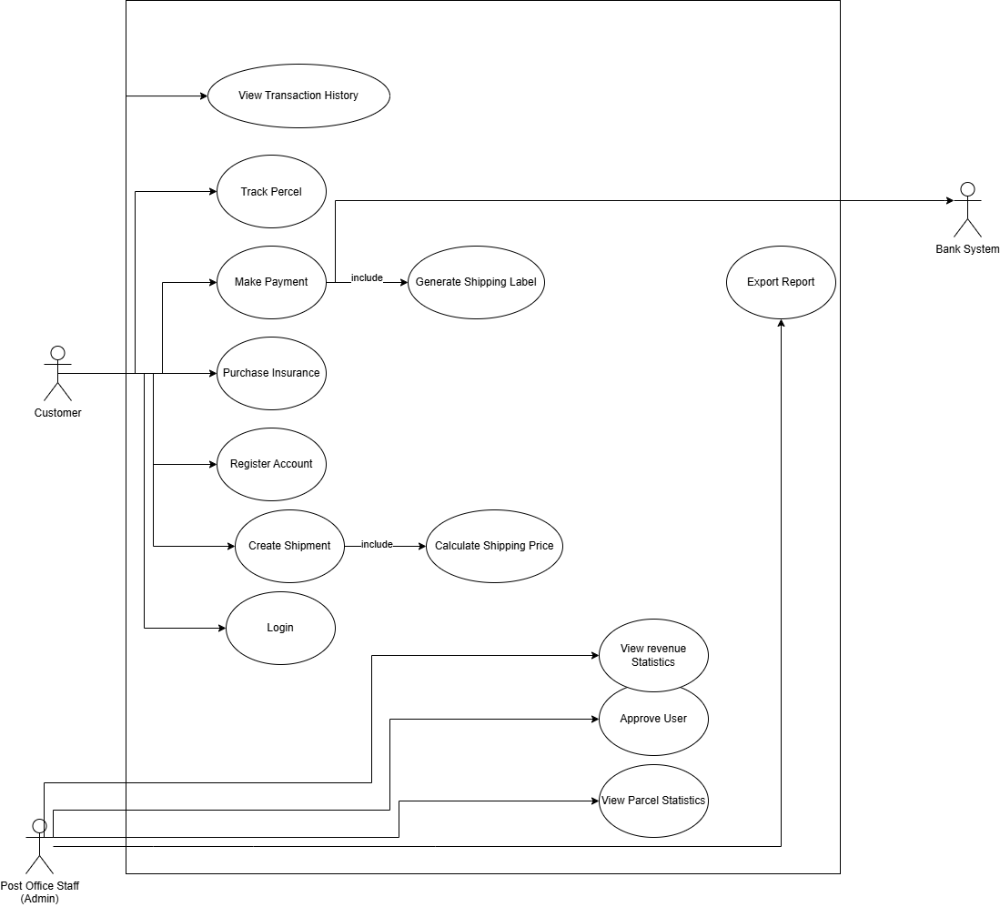
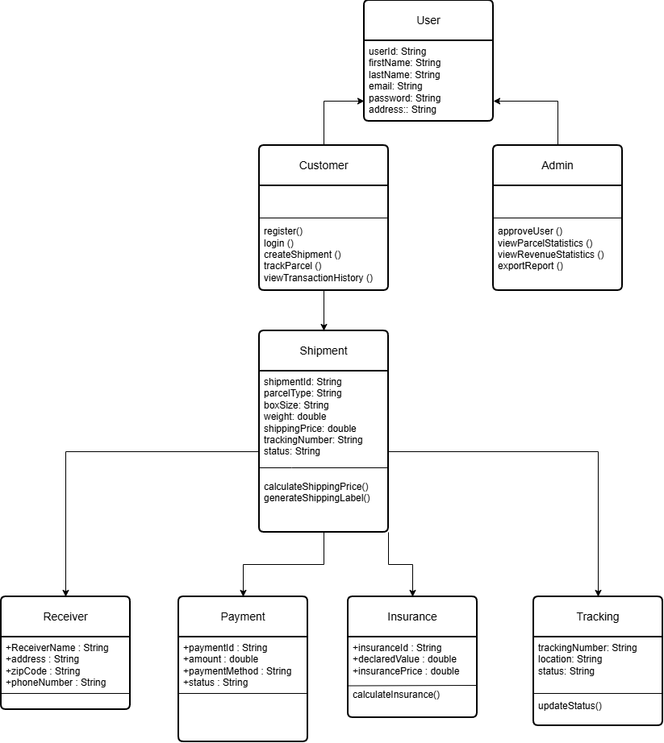
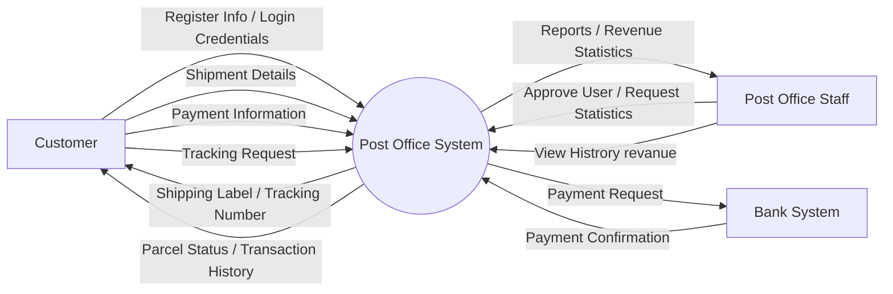
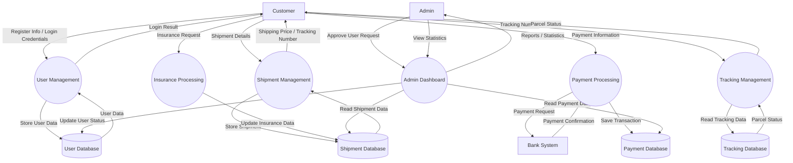

# C4 DIAGRAM

## Context Diagram

## Container Diagram
### Bank System
.svg)

## Component Diagram
![Component Diagram]

### Use Case Diagram

### Class Diagram

# DFD Diagram (Level 0)

# DFD Diagram (Level 1)

