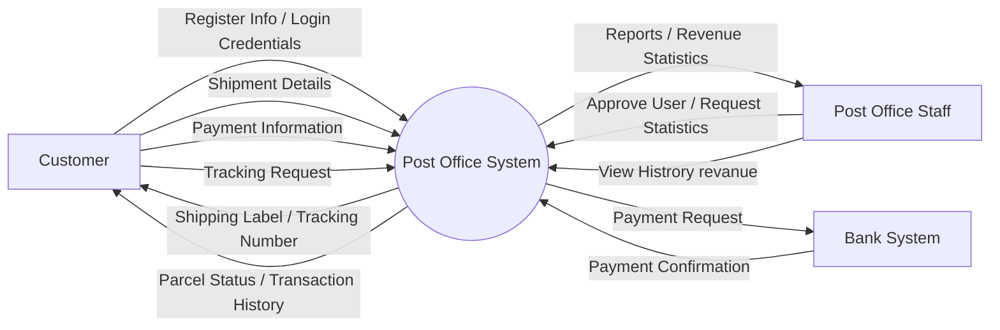
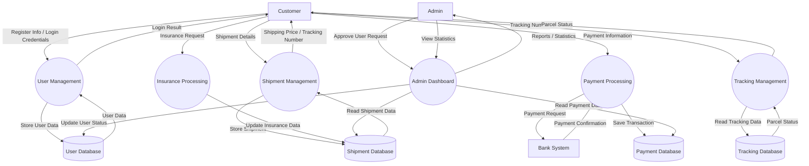

# C4 DIAGRAM

# Context Diagram 

[]

# Use Case Diagram
designs/use-case-diagram.png

# Class Diagram
designs/class-diagram.png

# DFD Diagram (Level 0)

```mermaid
flowchart LR

Customer[Customer]
Admin[Post Office Staff]
Bank[Bank System]

System((Post Office System))

Customer -->|Register Info / Login Credentials| System
Customer -->|Shipment Details| System
Customer -->|Payment Information| System
Customer -->|Tracking Request| System

System -->|Shipping Label / Tracking Number| Customer
System -->|Parcel Status / Transaction History| Customer

Admin -->|Approve User / Request Statistics| System
System -->|Reports / Revenue Statistics| Admin
Admin -->|View Histrory revanue| System

System -->|Payment Request| Bank
Bank -->|Payment Confirmation| System
```

# DFD Diagram (Level 1)

```mermaid
flowchart TB

Customer[Customer]
Admin[Admin]
Bank[Bank System]

P1((User Management))
P2((Shipment Management))
P3((Payment Processing))
P4((Tracking Management))
P5((Insurance Processing))
P6((Admin Dashboard))

D1[(User Database)]
D2[(Shipment Database)]
D3[(Payment Database)]
D4[(Tracking Database)]

%% User Management
Customer -->|Register Info / Login Credentials| P1
P1 -->|Store User Data| D1
D1 -->|User Data| P1
P1 -->|Login Result| Customer

%% Shipment Management
Customer -->|Shipment Details| P2
P2 -->|Store Shipment| D2
D2 -->|Shipment Data| P2
P2 -->|Shipping Price / Tracking Number| Customer

%% Insurance
Customer -->|Insurance Request| P5
P5 -->|Update Insurance Data| D2

%% Payment
Customer -->|Payment Information| P3
P3 -->|Payment Request| Bank
Bank -->|Payment Confirmation| P3
P3 -->|Save Transaction| D3

%% Tracking
Customer -->|Tracking Number| P4
P4 -->|Read Tracking Data| D4
D4 -->|Parcel Status| P4
P4 -->|Parcel Status| Customer

%% Admin
Admin -->|Approve User Request| P6
P6 -->|Update User Status| D1

Admin -->|View Statistics| P6
P6 -->|Read Shipment Data| D2
P6 -->|Read Payment Data| D3

P6 -->|Reports / Statistics| Admin
```

